<h3><code>parth@github ~ $ ./contributions.sh</code></h3>

  

<h3><code>parth@github ~ $ whoami</code></h3>
<table>
<tr>
<td valign="top"></td>
<td valign="top"></td>
</tr>
</table>

# Hi, I'm Parth Singh

CS (ML & Data Science) at the University of Indianapolis. I build local-first AI tools and report where each one fails.

Currently: LLM evaluation and benchmark design, Handshake AI (Mar 2026 to present).

## Projects

- [**same**](https://github.com/Ps23102004/same): find every photo that contains a specific object, on-device. DINOv2 candidates, SIFT/RANSAC verification.
- [**llm-ladder**](https://github.com/Ps23102004/llm-ladder): runs a prompt on a small local LLM first and moves to a bigger one when repeated answers disagree.
- [**Cutroom**](https://github.com/Ps23102004/Cutroom): desktop video editor in Rust (Tauri) with local AI models. Installers for macOS, Windows, Linux.
- [**agent-office**](https://github.com/Ps23102004/agent-office): my fork of a 3D workspace for coding agents. Added a low-power graphics mode, a city, driving physics, a race track and an arena.
- [**VisaRadar**](https://github.com/Ps23102004/VisaRadar): checks whether an employer sponsors visas, using real Department of Labor filings.
- [**homeground**](https://github.com/Ps23102004/homeground): type your address, ride a longboard down your own street. OpenStreetMap data rebuilt as a 3D level.

## Stack

Python · PyTorch · TypeScript · Rust · FastAPI · Three.js / WebGPU · Ollama · scikit-learn

---

Indianapolis, IN · open to Summer 2027 internships · [LinkedIn](https://www.linkedin.com/in/parth-singh-8310bb402) · psingh@uindy.edu
